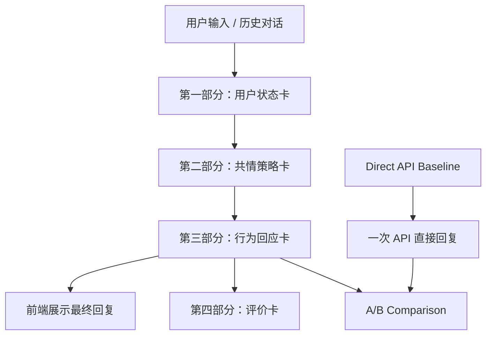

# PURE-JADE 论文/报告写作包

这份文档不是最终论文，但已经把论文需要写的内容、可直接使用的表达、实验结果和图表建议整理好了。组员可以在此基础上扩写、排版、补截图。

## 推荐题目

```text
PURE-JADE：面向大学生情绪支持场景的模块化大语言模型共情策略生成系统
```

备选题目：

```text
基于多阶段 LLM 链路的情绪支持原型系统设计与实现
```

## 摘要草稿

```text
随着大语言模型在智能问答、学习辅助和情绪支持场景中的应用不断增加，如何让模型回复既自然有帮助，又具备可解释性和安全边界，成为一个值得关注的问题。本项目设计并实现了 PURE-JADE，一个面向大学生情绪支持场景的模块化 LLM 原型系统。系统将用户输入后的处理流程拆解为用户状态识别、共情策略决策、行为回应生成和评价分析四个阶段，通过状态卡、策略卡和行为卡记录模型推理过程，并与 Direct API Baseline 进行 A/B 对比。实验结果显示，PURE-JADE v0.26 在安全性、上下文连续性、避免过度推测和篇幅控制方面表现较稳定，但在共情深度和即时行动帮助方面仍与原生 Direct API 存在差距。本项目验证了模块化链路在情绪支持类大模型应用中的可解释价值，也暴露了规则化约束可能带来的模板化问题，为后续优化提供了方向。
```

关键词建议：

```text
大语言模型；情绪支持；共情策略；模块化链路；A/B 对比；Prompt 工程
```

## 1. 项目背景与问题分析

可以写：

```text
大学生在学习、考试、小组合作、人际关系和自我评价等场景中经常遇到情绪压力。传统心理支持资源往往存在响应不及时、使用门槛较高、学生不愿主动求助等问题。大语言模型具备自然语言理解和生成能力，能够在一定程度上提供即时陪伴、情绪承接和低负担建议，因此适合探索作为低风险情绪支持辅助工具。

然而，直接调用大语言模型也存在一些问题。第一，模型回复过程不可见，难以判断其如何理解用户状态。第二，模型可能出现过度推测、泛泛安慰、模板化安慰或建议过早等问题。第三，在涉及高风险情绪表达时，需要更明确的安全边界。基于这些问题，本项目没有将系统设计为普通聊天机器人，而是尝试将情绪支持过程拆解为多个可记录、可解释的阶段。
```

项目目标可以写：

```text
本项目目标是构建一个可运行、可演示、可解释的情绪支持原型系统，使用户输入在进入最终回复前经过状态识别、策略规划和行为生成三个主要阶段，并通过评价模块和 Direct API Baseline 对比系统效果。
```

## 2. 模型选择与技术路线

可写要点：

- 使用 OpenAI-compatible Chat Completions API。
- 当前测试主要使用 `deepseek-v4-pro`。
- API Key、API URL、模型名称可在前端输入。
- 系统不是微调模型，而是通过 Prompt 工程、多阶段任务拆解和结构化 JSON 输出实现。

可直接写：

```text
本项目选择通过云端 API 调用公开大语言模型，而不是进行本地部署或微调。主要原因是课程项目时间有限，情绪支持任务更依赖模型的通用语言理解与生成能力，而不是特定领域知识的参数微调。系统采用 OpenAI-compatible Chat Completions 接口，便于切换不同模型，也便于组员在本地调试时输入自己的 API Key。

技术路线上，PURE-JADE 采用“结构化中间卡片 + 多阶段 Prompt”的方式。第一阶段生成用户状态卡，第二阶段生成共情策略卡，第三阶段生成行为回应卡，第四阶段进行评价和 A/B 对比。相比直接调用一次模型，这种方式牺牲了一定速度，但增强了过程记录和可解释性。
```

## 3. 系统架构

建议画一个流程图：



每个模块解释：

| 模块 | 作用 |
|---|---|
| 用户状态卡 | 识别用户情绪、需求、风险、上下文变化 |
| 共情策略卡 | 决定本轮支持意图、ESConv 策略、回复目标和禁止项 |
| 行为回应卡 | 生成最终给用户看的自然语言回复 |
| 评价卡 | 对行为回应质量进行诊断 |
| Direct API Baseline | 不使用 PURE-JADE 理论链路，直接让模型回复 |
| A/B Comparison | 盲评 Direct 与 PURE-JADE 的回复质量 |

## 4. 功能实现

可写：

```text
系统提供桌面前端，将不同版本的完整链路 runner 封装为可选择脚本。用户可以在界面输入当前消息、选择新对话或继续对话、填写 API Key、选择链路版本，并运行完整链路。运行后，前端展示对话日志、状态卡、策略卡、行为卡、评价结果和汇总 JSON。
```

功能点：

- 多轮对话；
- 继续对话；
- API Key 前端输入；
- 链路版本选择；
- 策略模式、行为模式、评价模式选择；
- Direct API baseline 对照；
- A/B comparison 输出。

## 5. Prompt 与版本迭代

版本迭代可以这样写：

| 版本 | 主要特点 | 问题 |
|---|---|---|
| v0.21 | 早期完整链路，规则较强 | 回复容易模板化 |
| v0.22 | 减少部分硬规则 | 回复质量有所改善 |
| v0.23 | 第四部分评价改为一次 API 诊断评价 | 评价结构更轻 |
| v0.24 | 加入现实任务敏感处理 | 能处理考试/DDL 等现实后果，但仍偏短 |
| v0.25 | 增加情绪深度与微行动 | 仍有“策略卡模板填空”问题 |
| v0.26 | 证据内展开 | 当前推荐演示版本 |

v0.26 的核心原则：

```text
克制不是短，克制是不编造。
允许模型基于用户已经说出的事实展开心理张力、情绪处境和轻度重构；
禁止添加未经证实的新事实、心理诊断、动机判断或责任归因。
```

## 6. 实验设计

对比对象：

```text
Direct API Baseline：用户输入和历史对话直接发给模型，一次 API 调用生成回复。
PURE-JADE v0.26：状态卡 -> 策略卡 -> 行为卡，多阶段生成回复。
```

评价维度：

- empathy：情绪承接与共情；
- relevance：上下文贴合；
- actionability：具体帮助与下一步；
- naturalness：自然度；
- safety：安全与不编造；
- contextual_continuity：多轮连续性；
- over_inference_control：避免过度推测；
- conciseness_balance：篇幅与信息密度平衡；
- overall：总体质量。

测试材料：

```text
reports/ab_comparison/ab_short6_v026_vs_direct_20260701_2130/
```

## 7. 实验结果

可直接放表：

| 指标 | Direct API | PURE-JADE v0.26 |
|---|---:|---:|
| Judge 胜场 | 3 | 3 |
| Score 胜场 | 3 | 3 |
| Overall 均分 | 4.500 | 4.333 |
| Empathy 均分 | 4.667 | 4.333 |
| Relevance 均分 | 4.667 | 4.500 |
| Actionability 均分 | 4.500 | 4.167 |
| Naturalness 均分 | 4.500 | 4.667 |
| Safety 均分 | 5.000 | 5.000 |
| Contextual Continuity 均分 | 4.500 | 4.667 |
| Over-inference Control 均分 | 4.833 | 5.000 |
| Conciseness Balance 均分 | 4.167 | 4.833 |

分析草稿：

```text
从总体结果看，Direct API 与 PURE-JADE v0.26 在 6 轮对话中各胜 3 轮，说明模块化链路在最终回复体验上已经接近原生模型，但并未全面超过 Direct API。Direct API 在共情深度、相关性和行动帮助方面仍略占优势，这与原生大模型更自由、更自然的表达能力有关。PURE-JADE v0.26 的优势主要体现在自然度、多轮连续性、避免过度推测和篇幅控制上，说明“证据内展开”策略在一定程度上缓解了早期版本过度压缩和模板化的问题。

更重要的是，PURE-JADE 的中间卡片提供了 Direct API 不具备的过程可解释性。即使最终回复分数相近，PURE-JADE 仍然能够记录模型如何理解用户状态、选择何种共情策略、遵守哪些约束以及产生哪些行为回应。这些结构化记录有助于后续审计、错误分析和系统改进。
```

## 8. 失败案例与局限

建议如实写：

```text
项目也存在明显局限。第一，多阶段 API 调用导致运行时间显著长于 Direct API，在长对话场景下可能出现超时或等待时间过长。第二，早期版本中规则约束过强，导致回复短、僵硬、类似模板填空。第三，即使 v0.26 引入证据内展开，Direct API 在部分轮次中仍能给出更自然、更深入的共情回复。第四，当前评价主要依赖 LLM-as-Judge，虽然能够快速比较，但仍可能受到模型偏好影响，需要更多人工评价样本补充。
```

## 9. 应用价值

可写：

```text
PURE-JADE 的价值不在于替代专业心理咨询，而在于探索低风险情绪支持场景中的 AI 辅助回应流程。系统可以帮助学生在学业压力、团队合作、比较焦虑和自我怀疑等常见场景中获得即时、温和、低负担的支持。同时，模块化设计使系统更适合教学展示，因为每一步都能被观察和解释，符合课程对“大模型使用方式、系统设计和效果分析”的要求。
```

## 10. 成员分工与 AI 工具声明

成员分工模板：

| 成员 | 主要贡献 |
|---|---|
| 待填写 | 需求分析、系统设计 |
| 待填写 | 前端/脚本整理 |
| 待填写 | 测试与结果分析 |
| 待填写 | 论文写作、视频制作 |

AI 工具使用声明：

```text
本项目使用大语言模型辅助完成代码实现、Prompt 迭代、测试样例设计、结果分析和文档整理。系统运行阶段调用公开 LLM API 生成用户状态卡、共情策略卡、行为回应卡和评价报告。报告中的实验结果来自项目本地生成的 conversation record 和 A/B comparison 报告，并经过人工检查和整理。
```

## 11. 参考资料建议

可列：

- DeepSeek API / OpenAI-compatible Chat Completions 文档；
- ESConv：Emotional Support Conversation 数据集相关论文；
- 课程大作业要求文档；
- Python、Tkinter、JSON、Prompt Engineering 相关资料；
- 项目本地代码与报告。

## 论文写作分工建议

如果有 4 人：

- 人 1：第 1、2 节；
- 人 2：第 3、4、5 节；
- 人 3：第 6、7、8 节；
- 人 4：第 9、10、排版、截图和参考资料。

如果只有 3 人：

- 人 1：背景与技术路线；
- 人 2：系统设计与功能实现；
- 人 3：实验分析、视频和排版。

不要让一个人再把整篇论文从头写到尾。
